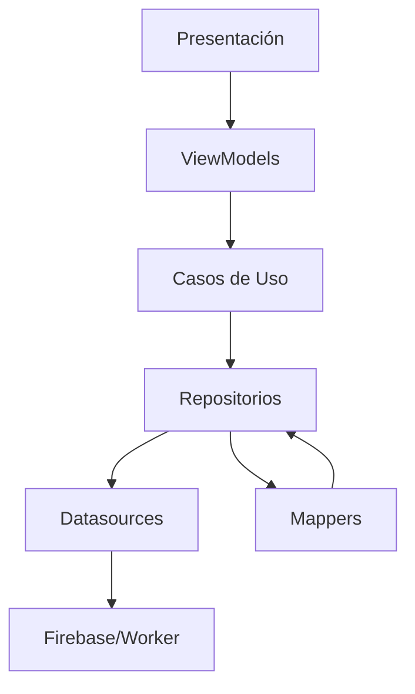
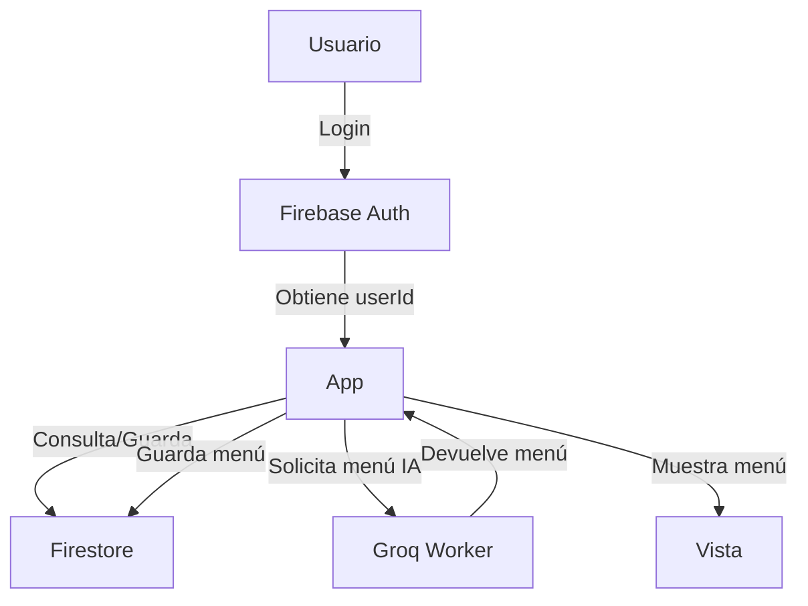

# SmartMealApp - Documentación Técnica Completa

## Índice

- [SmartMealApp - Documentación Técnica Completa](#smartmealapp---documentación-técnica-completa)
  - [Índice](#índice)
  - [Introducción](#introducción)
  - [Objetivo del Proyecto](#objetivo-del-proyecto)
  - [Arquitectura General](#arquitectura-general)
    - [Diagrama de Capas](#diagrama-de-capas)
  - [Tecnologías Utilizadas](#tecnologías-utilizadas)
  - [Versiones de Tecnologías Utilizadas](#versiones-de-tecnologías-utilizadas)
  - [Estructura de Carpetas](#estructura-de-carpetas)
  - [Diagrama de Flujo General](#diagrama-de-flujo-general)
  - [Lógica Principal y Flujo de Datos](#lógica-principal-y-flujo-de-datos)
    - [1. **Inicio de sesión y autenticación**](#1-inicio-de-sesión-y-autenticación)
    - [2. **Gestión de recetas**](#2-gestión-de-recetas)
    - [3. **Gestión de menús semanales**](#3-gestión-de-menús-semanales)
    - [4. **Generación automática de menús**](#4-generación-automática-de-menús)
    - [5. **Presentación y lógica desacoplada**](#5-presentación-y-lógica-desacoplada)
  - [Gestión de Menús y Recetas](#gestión-de-menús-y-recetas)
    - [Estructura de una receta](#estructura-de-una-receta)
    - [Estructura de un menú semanal](#estructura-de-un-menú-semanal)
    - [Ejemplo de flujo de guardado de menú](#ejemplo-de-flujo-de-guardado-de-menú)
  - [Backend Worker (Groq Worker)](#backend-worker-groq-worker)
    - [Ejemplo de petición al Worker](#ejemplo-de-petición-al-worker)
    - [Ejemplo de respuesta](#ejemplo-de-respuesta)
  - [Integración con Firebase](#integración-con-firebase)
  - [Mappers y Modelos](#mappers-y-modelos)
    - [Ejemplo de RecipeMapper](#ejemplo-de-recipemapper)
    - [Ejemplo de WeeklyMenuMapper](#ejemplo-de-weeklymenumapper)
  - [Testing](#testing)
    - [Ejemplo de test en Flutter](#ejemplo-de-test-en-flutter)
  - [Despliegue y Ejecución](#despliegue-y-ejecución)
    - [App móvil](#app-móvil)
    - [Worker](#worker)
  - [Casos de Uso](#casos-de-uso)
    - [1. Crear receta](#1-crear-receta)
    - [2. Generar menú semanal](#2-generar-menú-semanal)
    - [3. Consultar recetas por tipo](#3-consultar-recetas-por-tipo)
  - [Ejemplos de Código](#ejemplos-de-código)
    - [Ejemplo de consulta de recetas por tipo](#ejemplo-de-consulta-de-recetas-por-tipo)
    - [Ejemplo de guardado de menú](#ejemplo-de-guardado-de-menú)
  - [Notas y Buenas Prácticas](#notas-y-buenas-prácticas)
  - [Contacto y dudas](#contacto-y-dudas)

---

## Introducción

SmartMealApp es una aplicación móvil desarrollada en Flutter que permite a los usuarios gestionar menús semanales, recetas y listas de la compra personalizadas, integrando lógica nutricional y generación automática de menús mediante IA.

---

## Objetivo del Proyecto

- Permitir a cada usuario crear, consultar y modificar menús semanales personalizados.
- Gestionar recetas y asociarlas a los menús por tipo de comida (desayuno, comida, cena, snack).
- Generar menús automáticamente usando un backend propio (Groq Worker).
- Mantener la lógica desacoplada y modular siguiendo Clean Architecture y MVVM.

---

## Arquitectura General

El proyecto sigue Clean Architecture y MVVM, separando claramente la lógica de negocio, la presentación y el acceso a datos.

- **Presentación:** Vistas y ViewModels (Flutter, Provider).
- **Dominio:** Entidades, repositorios y casos de uso.
- **Datos:** Modelos, mappers y datasources (Firebase, Worker).
- **Core:** Utilidades, constantes y errores globales.

### Diagrama de Capas



---

## Tecnologías Utilizadas

- **Flutter:** Framework principal para la app móvil.
- **Firebase:** Autenticación, Firestore para almacenamiento de menús y recetas.
- **Cloudflare Worker:** Backend propio para generación de menús con IA.
- **Provider:** Gestión de estado en Flutter.
- **Dart:** Lenguaje principal.
- **Vitest:** Testing en el Worker.
- **Wrangler:** Despliegue de Workers.

---

## Versiones de Tecnologías Utilizadas

| Tecnología                        | Versión utilizada         | Archivo de referencia         |
|------------------------------------|--------------------------|------------------------------|
| **Flutter SDK**                    | ^3.9.2                   | `pubspec.yaml` (environment)  |
| **Dart SDK**                       | ^3.9.2                   | `pubspec.yaml` (environment)  |
| **provider**                       | ^6.1.1                   | `pubspec.yaml`                |
| **firebase_auth**                  | ^5.4.0                   | `pubspec.yaml`                |
| **cloud_firestore**                | ^5.6.12                  | `pubspec.yaml`                |
| **firebase_core_platform_interface** | ^6.0.2                 | `pubspec.yaml`                |
| **get_it**                         | ^7.7.0                   | `pubspec.yaml`                |
| **shared_preferences**             | ^2.2.2                   | `pubspec.yaml`                |
| **google_generative_ai**           | ^0.4.0                   | `pubspec.yaml`                |
| **http**                           | ^1.1.0                   | `pubspec.yaml`                |
| **flutter_launcher_icons**         | ^0.13.1                  | `pubspec.yaml` (dev)          |
| **flutter_lints**                  | ^5.0.0                   | `pubspec.yaml` (dev)          |
| **mockito**                        | ^5.5.1                   | `pubspec.yaml` (dev)          |
| **cupertino_icons**                | ^1.0.8                   | `pubspec.yaml`                |
| **Cloudflare Wrangler**            | ^4.50.0                  | `groq_worker/groq-worker/package.json` |
| **Vitest**                         | ~3.2.0                   | `groq_worker/groq-worker/package.json` |
| **@cloudflare/vitest-pool-workers**| ^0.8.19                  | `groq_worker/groq-worker/package.json` |

---

> **Nota:**
> Las versiones aquí listadas corresponden a la configuración actual del proyecto.
> Para actualizar dependencias, modifica los archivos `pubspec.yaml` (Flutter/Dart) y `package.json` (Node.js/Worker) y ejecuta los comandos de instalación correspondientes.

---

## Estructura de Carpetas

```
SmartMealApp/
  ├── android/                # Proyecto nativo Android
  ├── assets/                 # Recursos gráficos
  ├── build/                  # Archivos generados
  ├── cloud_firestore/        # Plugins y dependencias
  ├── groq_worker/            # Backend Worker para IA
  ├── lib/
  │   ├── core/               # Utilidades, constantes, errores
  │   ├── data/               # Modelos, mappers, datasources, repositorios
  │   ├── domain/             # Entidades, casos de uso, repositorios
  │   ├── presentation/       # Vistas, widgets, viewmodels
  │   └── firebase_options.dart
  │   └── main.dart
  ├── test/                   # Tests unitarios y de integración
  ├── pubspec.yaml            # Dependencias Flutter/Dart
  └── README.md               # Documentación principal
```

---

## Diagrama de Flujo General



---

## Lógica Principal y Flujo de Datos

### 1. **Inicio de sesión y autenticación**
- El usuario se autentica mediante Firebase Auth.
- Se obtiene el `userId` para todas las operaciones de Firestore.

### 2. **Gestión de recetas**
- Las recetas se guardan en la colección `users/{userId}/recipes`.
- Cada receta tiene: nombre, descripción, ingredientes, calorías, tipo de comida, fechas de creación/actualización.
- Los mappers (`RecipeMapper`) convierten entre entidades y modelos para mantener la lógica fuera de las vistas y modelos.

### 3. **Gestión de menús semanales**
- Los menús se guardan en `users/{userId}/weekly_menus`.
- Cada menú contiene los días de la semana y las recetas asociadas por tipo.
- El flujo de guardado y consulta usa mappers (`WeeklyMenuMapper`) para transformar los datos entre Firestore y las entidades de dominio.

### 4. **Generación automática de menús**
- El usuario puede solicitar la generación automática de un menú semanal.
- La petición se envía al backend Worker (`groq_worker`), que responde con un menú generado por IA.
- El menú generado se guarda en Firestore y se muestra en la app.

### 5. **Presentación y lógica desacoplada**
- Las vistas (`presentation/`) solo muestran datos y delegan toda la lógica a los ViewModels.
- Los ViewModels usan casos de uso y mappers para interactuar con los datos y la lógica de negocio.

---

## Gestión de Menús y Recetas

### Estructura de una receta

```dart
class Recipe {
  final String id;
  final RecipeName name;
  final RecipeDescription description;
  final List<String> ingredients;
  final int calories;
  final MealType mealType;
  final DateTime? createdAt;
  final DateTime? updatedAt;
}
```

### Estructura de un menú semanal

```dart
class WeeklyMenu {
  final String id;
  final String userId;
  final String name;
  final DateTime weekStartDate;
  final List<DayMenu> days;
  final DateTime? createdAt;
  final DateTime? updatedAt;
}
```

### Ejemplo de flujo de guardado de menú

1. El usuario genera o edita un menú.
2. El ViewModel llama al caso de uso correspondiente.
3. El caso de uso utiliza el mapper para convertir la entidad a modelo.
4. El modelo se guarda en Firestore.

---

## Backend Worker (Groq Worker)

- El Worker recibe peticiones POST con los datos del usuario y preferencias.
- Genera menús usando IA y responde con la estructura adecuada.
- Se despliega y gestiona con Wrangler.
- El frontend nunca expone claves ni lógica sensible.

### Ejemplo de petición al Worker

```json
POST /generate-menu
{
  "userId": "abc123",
  "preferences": {
    "goal": "perder peso",
    "allergies": ["gluten"]
  }
}
```

### Ejemplo de respuesta

```json
{
  "weekStartDate": "2025-11-24",
  "days": [
    {
      "day": "Lunes",
      "recipes": ["id_receta_1", "id_receta_2"]
    },
    ...
  ]
}
```

---

## Integración con Firebase

- **Firestore:** Almacena menús y recetas por usuario.
- **Auth:** Gestiona la autenticación y el acceso seguro a los datos.
- **Reglas:** Definidas en `firestore.rules` para proteger los datos de cada usuario.

---

## Mappers y Modelos

### Ejemplo de RecipeMapper

```dart
class RecipeMapper {
  static RecipeModel fromEntity(Recipe entity) {
    return RecipeModel(
      id: entity.id,
      name: entity.name.value,
      description: entity.description.value,
      ingredients: entity.ingredients,
      calories: entity.calories,
      mealType: mealTypeToString(entity.mealType),
      createdAt: entity.createdAt,
      updatedAt: entity.updatedAt,
    );
  }

  static Recipe toEntity(RecipeModel model) {
    return model.toEntity();
  }
}
```

### Ejemplo de WeeklyMenuMapper

```dart
class WeeklyMenuMapper {
  static Future<WeeklyMenu> toEntity(
    WeeklyMenuModel model,
    Future<Recipe?> Function(String) getRecipeById,
  ) async {
    // ...lógica de conversión...
  }

  static WeeklyMenuModel fromEntity(WeeklyMenu entity) {
    // ...lógica de conversión...
  }
}
```

---

## Testing

- **Vitest:** Para el Worker.
- **Flutter Test:** Para la app móvil (carpeta `test/`).

### Ejemplo de test en Flutter

```dart
import 'package:flutter_test/flutter_test.dart';
import 'package:smartmeal/domain/entities/recipe.dart';

void main() {
  test('RecipeName no acepta cadenas vacías', () {
    expect(() => RecipeName(''), throwsException);
  });
}
```

---

## Despliegue y Ejecución

### App móvil

```bash
flutter pub get
flutter run
```

### Worker

```bash
npm install
npm run deploy
```

---

## Casos de Uso

### 1. Crear receta

- El usuario introduce los datos de la receta.
- El ViewModel valida y llama al caso de uso de guardado.
- El repositorio guarda la receta en Firestore.

### 2. Generar menú semanal

- El usuario solicita la generación automática.
- El ViewModel envía la petición al Worker.
- El Worker responde con el menú generado.
- El menú se guarda y se muestra en la app.

### 3. Consultar recetas por tipo

- El usuario filtra recetas por desayuno, comida, cena o snack.
- El ViewModel llama al caso de uso correspondiente.
- El repositorio consulta Firestore y devuelve las recetas filtradas.

---

## Ejemplos de Código

### Ejemplo de consulta de recetas por tipo

```dart
final recipes = await recipeRepository.getRecipesByMealType(MealType.lunch, userId);
```

### Ejemplo de guardado de menú

```dart
final menuModel = WeeklyMenuMapper.fromEntity(menu);
await firestore.collection('users').doc(userId).collection('weekly_menus').add(menuModel.toFirestore());
```

---

## Notas y Buenas Prácticas

- Toda la lógica de negocio y conversión de datos está fuera de las vistas.
- Los mappers garantizan la modularidad y el desacoplamiento.
- La arquitectura facilita el testing y la escalabilidad.
- El backend nunca expone claves ni lógica sensible al cliente.
- Mantén los modelos y entidades separados y usa mappers para toda conversión.

---

## Contacto y dudas

Para cualquier duda sobre la arquitectura, el flujo o la lógica, consulta los archivos en la carpeta `lib/` y la documentación de cada clase y método.

---
